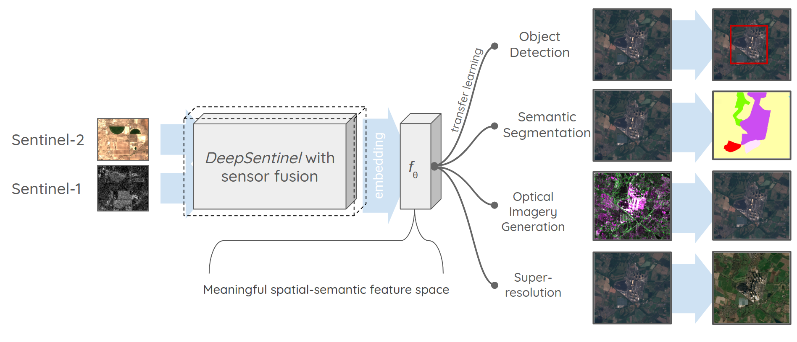

# _DeepSentinel_
_DeepSentinel_: a sentinel-1 and -2 sensor fusion model for semantic embedding. A Copernicus Master's Finalist supported by Descartes Labs Impact Science Programme and Microsoft AI for Earth.

## Introduction
Earth observation offers new insight into anthropogenic changes to nature, and how these changes are effecting (and are effected by) the built environment and the real economy. With the global availability of medium-resolution (\~10m) synthetic aperature radar (SAR) Sentinel-1 and multispectral Sentinel-2 imagery, machine learning can be employed to offer these insights at scale, unbiased to company- and country-level reporting.

Machine learning applications using earth observation imagery present some unique problems. Multispectral images are often confounded by interference from clouds and atmosphere conditions. And while there is ample imagery data, geospatially-localised labels are sparse, with data quality and completeness heavily geographically skewed.

_DeepSentinel_ seeks to address these problems. DeepSentinel fuses Sentinel-2 imagery with Sentinel-1 SAR imagery which is unobstructed by clouds and atmospher conditions. We are building the largest publicly available corpus of matched Sentinel-1 and -2 imagery for the purposes of self-supervised pre-training. For select geographies, we sample the best-available land-use and land-cover datasets.

Our goal is to produce pre-trained general purpose convolutional neural networks for a number of use cases, see Figure 1. We want DeepSentinel to be as widely accessible as possible - we are developing our training corpus and models with both DescartesLabs and Google Earth Engine samples and are developing everything open-source. Please check back regularly for updates or watch or star!

*Figure 1:* Summary of _DeepSentinel_

More details can be found at our ESA Phi-Week presentation [here](https://docs.google.com/presentation/d/1uWnbfVeZz21IY59E2RCHbfM-f7V5-xafEsuKpdTVAAE/edit?usp=sharing).

### Distribution

We are developing DeepSentinel open-source and make our training corpus and models publicly available via both Google Cloud Storage and Azure Storage requester-pays instances. The following products are currently available:

#### Training Corpuses
- DEMO_unlabelled: 10,000 Sentinel-1 + Sentinel-2 256-pixel patch size samples, sampled from the global earth land mass (except antarctica) between 2018-01-01 and 2019-01-05.
- DEMO_EU_labelled: 1,000 Sentinel-1 + Sentinel-2 256-pixel patch size samples, sampled from the EU28 between 2018-01-01 and 2019-01-05 with Copernicus Land Cover raster products.
- 100k_unlabelled: 100,000 Sentinel-1 + Sentinel-2 256-pixel patch size samples, sampled from the global earth land mass (except antarctica) between 2019-01-01 and 2020-01-05.

#### Pre-trained Models
- Forthcoming - check back soon!

## Acknowledgements

We are extremely grateful for the ongoing support of [DescartesLabs Impact Science Programme](https://www.descarteslabs.com/impact_science/) and [Microsoft AI for Earth](https://www.microsoft.com/en-us/ai/ai-for-earth) programme. This work is also supported by Google Research Credits.

## Installation

### Environment, Repo, and Packages

To use or contribute to this code base, please follow these instructions.

We recommend using [Conda](https://docs.conda.io/en/latest/miniconda.html) for environment management. Download and install Miniconda:

    wget https://repo.anaconda.com/miniconda/Miniconda3-latest-Linux-x86_64.sh

    sh ./Miniconda3-latest-Linux-x86_64.sh

Create a new environment (with python 3.6 to resolve for compatibility issues between packages) and activate it:

    conda create -n deepsentinel python=3.6

    conda activate deepsentinel

Clone this repo and enter it:

    git clone https://github.com/Lkruitwagen/deepsentinel.git

    cd deepsentinel

Install the requirements. To get the substantial performance improvements of combining pygeos and geopandas, we'll install them with Conda.

    conda install -c conda-forge --file conda_reqs.txt

    pip install -r pip_reqs.txt

### Credentials

This repo makes extensive use of third party services. 

#### Copernicus Open Access Hub

Copernicus Open Access Hub is used to access Sentinel catalog data. Obtain credentials from https://scihub.copernicus.eu/dhus/#/self-registration and save them in a `json` with `json.dump('{"scihub":{"U":"<yourusername>","P":"<yourpassword>"}}', open('<path/to/credentials.json>','w'))`. Edit the path in `CONFIG.yaml` and `bin/make_config.py`.

#### Descartes Labs

Descartes Labs is used to obtain Sentinel-1 and Sentinel-2 data. Contact [DescartesLabs](https://www.descarteslabs.com/) for platform access and then use `descarteslabs auth login` to log in and save the access token to your `$HOME` directory. 

#### Google Earth Engine

Google Earth Engine is used to obtain Sentinel-1 and Sentinel-2 data. Sign up for Earth Engine [here](https://earthengine.google.com/new_signup/). You will need REST API access, for which you may need to contact Earth Engine support. Create a service account for use with the REST API following instructions [here](https://developers.google.com/earth-engine/guides/service_account). Edit the path to your Earth Engine `json` credentials in `CONFIG.yaml` and `bin/make_config.py`.

#### Google Cloud Storage

To use your own google cloud storage bucket with _DeepSentinel_, create your own storage bucket, and then create a service account and `json` key, following instructions [here](https://cloud.google.com/iam/docs/creating-managing-service-account-keys). Edit the path to your GCP `json` credentials in `CONFIG.yaml` and `bin/make_config.py`.

#### Azure Cloud Storage

To use your own Azure cloud storage account with _DeepSentinel_, create your own storage account, and then obtain a connection string for it, copying `Connection string` of `key1` under the Access keys tab for your storage account. Save the string in a txt file and edit the path to your connection string file in `CONFIG.yaml` and `bin/make_config.py`.

    
## Useage

### Command Line Interface

The data pipeline and training for _DeepSentinel_ can all be controlled from the command line interface (CLI) [cli.py]. The CLI has three main task groups, which can be accessed using --help.

    Usage: cli.py [OPTIONS] COMMAND [ARGS]...

    Options:
      --help  Show this message and exit.

    Commands:
      generate-points   A method to seed points for a new dataset.
      generate-samples
      train

#### generate-points

To generate a new set of S1-S2 pairs, use `python cli.py generate-points`:

    Usage: cli.py generate-points [OPTIONS] START_DATE N_POINTS NAME

      A method to seed points for a new dataset.

      PARAMETERS
      ----------
      NAME: str
          The name of the new dataset.

      N_POINTS: int
          The number of data points to generate.

      START_DATE: str
          The start date for data collection in the form YYYY-mm-dd.

    Options:
      --conf TEXT         path to DATA_CONFIG.yaml
      --n-orbits INTEGER  The number of orbits to spread the simulated points
                          over.

      --end-date TEXT     the end date to stop sampling points, as YYYY-mm-dd
      --iso2 TEXT         A comma-separated list of iso-a2 country codes for
                          geographic subsampling

      --help              Show this message and exit.
      
_DeepSentinel_ uses the raw Copernicus data catalogues to generate coincident S1-S2 pairs. The temporal proximity between the two images can be controlled in the [DATA_CONFIG](conf/DATA_CONFIG.yaml) file. A `START_DATE` (YYYY-mm-dd) and `N_POINTS` must be specified for the new dataset, as well as a `NAME`, for example:

    python cli.py generate-points 2018-01-01 20000 20k_demodata

The orbits of S1 and S2 are coincident on a 12-day frequency, so _DeepSentinel_ generates a fixed number of points in each 12-day period. An `--end-date=YYYY-mm-dd` can optionally be specified instead of the number of orbits. The geographic area for generated points can be constrained using `--iso2=<comma-separated-list-of-iso_A2-codes>. An alternative configuration file can also be specified. For example:

    python cli.py generate-points 2018-01-01 20000 20k_altdata --end-date=2018-07-01 --iso2=CA,US,MX --conf=/my_path/MY_CONFIG.yaml
    
    
#### generate-samples

To download imagery associated with a dataset of S1-S2 pairs, use `python cli.py generate-samples`:

    Usage: cli.py generate-samples [OPTIONS] DESTINATIONS SOURCES NAME

      Download imagery samples for a seeded dataset.

      PARAMETERS
      ----------
      NAME: str
          The name of the dataset to download.

      SOURCES: str
          A comma-separated list of sources to download the matching data from. Must be in ['dl','gee','osm','clc']:
              dl: DescartesLabs (https://www.descarteslabs.com/)
              gee: Google Earth Engine (https://earthengine.google.com/)
              osm: OpenStreetMap (https://www.openstreetmap.org/, https://github.com/Lkruitwagen/deepsentinel-osm)
              clc: Copernicus Land Cover (https://land.copernicus.eu/pan-european/corine-land-cover, mirrored on DescartesLabs)

      DESTINATIONS: str
          A comma-separated list of desintations for the generated data. Must be in ['local','gcp','azure']:
              local: saved to <data_root>/<name>/
              gcp: saved to a Google Cloud Storage Bucket
              azure: saved to an Azure Cloud Storage Container

    Options:
      --conf TEXT  path to DATA_CONFIG.yaml
      --help       Show this message and exit.

#### train

### tensorboard

To use tensorboard to view experiments, run:

    tensorboard --logdir $PWD/experiments/tensorboard
    
This should start tensorboard running, usually at `localhost:6006`. To view tensorboard in your browser, create a remote ssh tunnel to your machine:

    ssh -N -f -L localhost:6006:localhost:6006 <username>@<ip-address>
    
Or on gcloud (you may need to be logged in with `gcloud auth login`):

    gcloud beta compute ssh --zone "<your-instance-zone>" "<your-instance-name>" --project "<your-instance-project>" -- -L 6006:localhost:6006